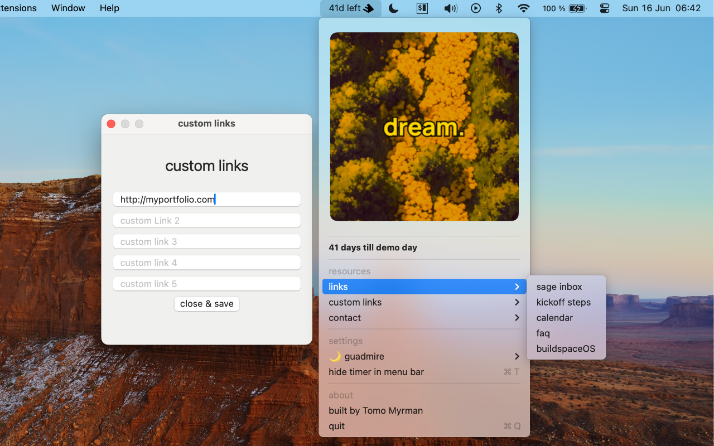

# buildspace menu app

welcome to the buildspace menu app! this is a handy tool designed to help you keep track of details and deadlines for the s5 buildspace.so program, for s5.

## screenshot

## how to install

not available yet! but coming soon.

## features

- **house selection**: choose your house from the options of "💋 spectreseek", "🌀 alterok", "🌙 gaudmire", "🌿 erevald". your selection is stored locally on your device and not shared with me.

- **custom links**: set up to five custom links for quick access to your most frequently visited pages. these are also stored locally.

- **resources dropdown**: access a variety of resources directly from the app, including the sage inbox, buildspaceOS, the calendar, kickoff steps, and the faq.

- **emails dropdown**: get in touch with the team quickly and easily with pre-filled email links.

- **social media dropdowns**: follow buildspace on twitter and instagram with just one click.

## associations

this app is not affiliated with buildspace or any of its programs. it is an independent project created by a buildspace student.

## security

the app is sandboxed as specified in the [`buildspace.entitlements`](buildspace%20menu%20app/buildspace.entitlements) file. this means the app cannot modify your files or access files without your explicit permission.

## privacy

your privacy is important to us. please read our [privacy policy](PRIVACY.md) for more information on how we handle your data.

## contact

if you have any questions or feedback, please get in touch with me at tomomyrman@proton.me.
